<!-- RYAN PANDA // CODENAME: AGENCY -->

  <a href="https://theagencymge.xyz"></a>

  

  

  

> **Hiring for an internship or have a contract project?** Email **[ryanpanda78@gmail.com](mailto:ryanpanda78@gmail.com)**, message me on [LinkedIn](https://linkedin.com/in/ryan-panda-5b021a352), or see more at **[theagencymge.xyz](https://theagencymge.xyz)**.


<b>LANGUAGES</b>  
  

<b>FRAMEWORKS & PLATFORMS</b>  
  

<b>AI, DESIGN & TOOLING</b>  
  

also: React Native · WPF · pandas · Hugging Face · LLM APIs · SQL

  

  <picture>
    <source media="(prefers-color-scheme: dark)" srcset="https://raw.githubusercontent.com/TheAgencyMGE/TheAgencyMGE/output/snake-dark.svg">
    
  </picture>

  <a href="https://github.com/TheAgencyMGE/aero-dock"></a>
  <a href="https://www.crusyn.app"></a>
  <a href="https://github.com/TheAgencyMGE/couchtop"></a>
  <a href="https://pcrecap.online"></a>
  <a href="https://github.com/TheAgencyMGE/FireGuard-AI"></a>
  <a href="https://github.com/TheAgencyMGE/nextup-pnw"></a>


  

  
  
  
  

  <b>Want to support my dev journey?</b>  
  

  

